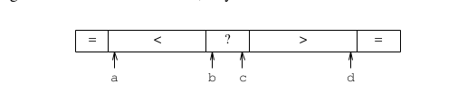

Date: 2013-03-08
Title: 高效的快速排序实现
Tags: 读书笔记, 算法, qsort, 快速排序

最近复习快速排序算法，无意中发现一篇由JON L. BENTLEY（编程珠矶的作者）和M. DOUGLAS McILROY（也是个牛人，见[wikipedia](http://en.wikipedia.org/wiki/Douglas_McIlroy))合著的一篇论文叫[Engineering a Sort Function](http://www.enseignement.polytechnique.fr/informatique/profs/Luc.Maranget/421/09/bentley93engineering.pdf).这篇文章详细讲述了怎么实现工业生产环境中适用的快速排序算法。记录下主要内容，权当做笔记。

##排序函数的接口

C语言标准库中有个函数叫qsort，主要就是实现这么一个函数。先看一个整数的插入排序的实现，虽然很慢，但是在工业生成环境中还是非常有用的，这个后面会提到。定义这个排序函数的名字为iisort(integer insert sort).实现如下：

    void iisort(int *a, int n)
	{
		int i, j;
		
		for (i  = 1; i < n; i++)
			for (j = i; j>0 && a[j-1] > a[j]; j--)
				iswap(j, j-1, a);

	}

通俗的说就是每次插入跟前面一个元素比较，前面的元素比当前的大，就交互，没当前的大就处理下一个元素。iswap是一个整数交互函数，用于交换a[j]和a[j-1]。对于一个随机排列的数组，插入排序的比较次数一般为n^2/4不会超过n^2/2。这个iisort只能支持整数，下面定义一个比较通用的排序函数：

    void qsort(char *a, int n, int es, int (*cmp)());

这个和c语言标准库<stdlib.h>中定义的void qsort(void *, size_t, size_t, int (*)(const void *, const void *));有点不同，但基本意思是一样的。第一个参数是一个指针，指向待排序的数组（不一定是char型数组哦，c语言的指针很灵活的，定义成char型是因为char占一个字节，方便转换成其它任意类型。比如四个字节的整型，遍历下个元素的时候只要把指针加4就可以了); 第二个参数表示待排序的元素个数；第三个参数表示每个元素所占的字节大小；第三个参数是一个比较函数，传入两个指针返回小于0，等于0，大于0的整数，分别对应于第一个指针指向的内容小于，等于，大于第二个指针指向的内容。这其实是C语言的回调函数，因为有些数据类型计算机不知道比较规则，不知道怎么比较大小，比如用户自定义了一个结构体，结构体的每个实例之间的大小关系，c语言是不知道的。就用这种方式把比较大小的规则通过回调函数的形式交给用户去制定。

下面按照这种通用的形式重写之前的插入排序函数：

    void isort(char *a, int n, int es, int (*cmp)())
	{
		char *pi, *pj;

		for (pi = a+es; pi < a+n*es; pi += es) //一个元素是es个字节，所以a+es表示指向第二个元素	
			for (pj = pi; pj > a && cmp(pj-es, pj) > 0; pj -= es)
				swap(pj, pj-es, es);//交互这两块内存

	}

交互内存的函数实现如下：

   void swap(char *i, char *j, int n)
   {
	   do {
		   char c = *i;
		   *i++ = *j;
		   *j++ = c;
	   }while(--n>0);
   }

就是一个字节一个字节的交互，总共每个元素是n字节。

##qsort的简单实现

快速排序主要是分治的思想，通过围绕一个元素将数组分成两部分，一部分全都比这个元素小，一部分比这个元素大，然后按相同的方法分别处理这两部分。快速排序是否高效主要体现在划分方法是否好。先用Lomuto提出的划分方法实现一个可用的快速排序. 这也是算法导论第二版介绍的划分方法，这里我按照自己的理解写了遍实现，跟原论文有点不一样:

    void iqsort0(int *a, int n)
	{
		int i, j;
		if (n <= 1)
			return;
		int key = a[n-1];
		for (i = -1, j = 0; j < n; j++)
			if (a[j] <= key) {
				i++;
				swap(i, j, a);
			}
		swap(i+1, n-1, a);
		iqsort0(a, i+1);
		iqsort0(a+i+2, n-i-2);
	}

我是按照算法导论上参照最后一个元素划分，原论文是按照第一个，其实差不多，只是我比较习惯按照最后一个了。Hoare(发明快速排序的人)证明了对于随机排列的元素不想同的数组，quicksort需要进行2nlnn∼1.386nlnn次比较。不幸的是，按照Lomuto的划分方法，当数组是排序好的情况下，需要n^2/2次比较。当数组元素全部相同时，也需要平方次比较。为了避免快排的最坏情况发生，Hore建议划分的时候围绕一个随机的元素划分，而不是固定的位置选取元素。

下面讲一种更高效的实现方法（貌似严蔚敏的数据结构那本书上用的就是这种方法，但我不知道为什么下面的方法比上面的高效，有知道的求指导）

用两个索引i，j。i从小到大遍历数组，j从大到小遍历数组。当i遇到比划分元素大的元素时，当j遇到比划分元素小的元素时，交换a[i]和a[j]，直到i>j。下面的实现结合了随机选取划分元素和这个划分方法：

    void iqsort1(int *a, int n)
	{
		int i, j;
		if (n <= 1)
			return;
		i = rand() % n;
		swap(0, i, a);
		i = 0;
		j = n;

		for(;;) {
			do{
				i++;
			}while(a[i] < a[0] && i < n);

			do{
				j--;
			}while(a[j] > a[0]);

			if (i > j)
				break;
			swap(i, j, a);
		}
		swap(0, j, a);
		iqsort1(a, j);
		iqsort1(a+j+1, n-j-1);
	}

这是针对整型的，对所有数据通用的实现如下：

   void qsort1(char *a, int n, int es, int (*cmp)())
   {
	   int j;
	   char *pi, *pj, *pn;

	   if (n <= 1)
		   return;
		pi = a + (rand()%n)*es;
		swap(a, pi, es);//注意这里的swap和针对整数的swap实现是不一样的，这里是按字节交换内存
		pi = a;
		pj = a+n*es;

		for(;;) {
			do {
				pi += es;
			}while(cmp(pi, a) < 0 && pi < a+n*es);

			do {
				pj -= es;
			}while(cmp(pj, a) > 0);

			if (pi > pj)
				break;
			swap(pi, pj, es);
		}
		swap(a, pj, es);

        j = (pj-a)/es;
		qsort1(a, j, es, cmp);
		qsort1(a+(j+1)*es, n-j-1, es, cmp);
   }

##选择划分元素

随机选择划分元素的快速排序算法，需要Cn ∼ 1.386nlgn次比较次数。我们现在试着减少公式前面的常数系数。我们这么想，每次划分后数组实际上是形成了一个二叉树，要保证效率，那么就要尽可能保证二叉树的高度不高，也就是要保证二叉树是平衡的。如果每次我们选出的划分元素恰好是整个待排序数组的中间元素，那么这时效率是最高的。这时比较次数变成了nlgn。但是，找一个数组真正的中间元素，也是要耗费计算代价的。下面我们探索一种近似的方法，代价稍微小点。

Hoare建议用一个数组的小样本的中位数作为划分元素，Singleton用一个数组的第一个元素，最后一个元素和中间的元素这三个元素的中间元素作为划分元素。如果用随机的三个元素的中间元素作为划分元素，能把比较次数的期望值降到12/7nlnn,约等于1.188nlnn。

下面的程序实现了三个元素中找中间元素的算法：

    static char *med3(char *a, char *b, char *c, int (*cmp)())
	{
		return cmp(a, b) < 0 ?
		    (cmp(b, c) < 0 ? b : cmp(a, c) < 0 ? c : a)
		   :(cmp(b, c) > 0 ? b : cmp(a, c) > 0 ? c : a);
	}

为了更进一步的降低常数系数，我们需要寻找更好的计算一个数组中位数的算法。这里我们采用Tukey’ "ninther"算法，这是个伪中位数算法，关于这个算法，这篇[博客](http://www.johndcook.com/blog/2009/06/23/tukey-median-ninther/)讲的比较详细。这里我大概描述下，就是取九个数，前三个数取中间大的数，中间三个数取中间大的数，后面三个数取中间大的数。最后，取出来的三个数取中间大的数。把这个数当作划分元素。这个过程最多耗费12次比较，这个数据对于大的数组来说是很小的开销，可是对于小的数组来说，是很大的开销。

基于上面的原因，我们这么处理：对于小数组，直接用数组中间下标对应的元素作为中位数；对于中等规模的数组，取第一个数组下标对应的元素，中间数组下标对应的元素和最后数组下标对应的元素的中间大小的元素；对于大规模的数组，采用Tukey’"ninther"算法。至于元素的多少算小规模数组，多少算中等规模数组，多少算大规模数组，完全是经验数据。具体实现如下：

    pm = a + (n/2)/es;
	if (n > 7) {
		pl = a;
		pn = a + (n-1)*es;
		if (n > 40) {
			s = (n/8)*es;
			pl = med3(pl, pl+s, pl+2*s, cmp);
			pm = med3(pm-s, pm, pm+s, cmp);
			pn = med3(pn-2*s, pn-s, pn, cmp);
		}
		pm = med3(pl, pm, pn, cmp);
	}

##数组中有相等元素的情况优化

用上述的划分方法配合qsort1函数，经过测试比普通的快排快了30-40倍，但是面对有很多重复数据的数组，变的很慢，比第七版unix中qsort的实现慢很多。原因是unix第七版中用的是扁平的划分，将数组划分为小于划分元素，等于划分元素，大于划分元素。但是第七版中划分的过程如下图：

问号代表还未处理的元素，这让代码变得复杂和慢。因为在处理问号这部分时，小于划分元素的元素需要额外O(n)的交换代价去越过等于的那部分元素。我们这里采用如下图所示的划分过程，

下标b往大的方向移动，小于的元素直接掠过，等于的元素和下标a对应的元素交换，遇到大于的元素停止。下标c采用类似的方式，最后交换b，c。这里就是多用了a，d两个下标去记录等于的情况，其它情况和qsort1类似，b，c就相当于i，j。对于整型的代码实现如下：

    void iqsort2(int *x, int n)
    {
        int a, b, c, d, l, h, s, v;
        if (n <= 1) return;
        v = x[rand() % n];
        a = b = 0;
        c = d = n-1;
        for (;;) {
            while (b <= c && x[b] <= v) {
	       if (x[b] == v) iswap(a++, b, x);
	       b++;
	   }
	   while (c >= b && x[c] >= v) {
	       if (x[c] == v) iswap(d--, c, x);
                c--;
            }
            if (b > c) break;
            iswap(b++, c--, x);
        }
        s = min(a, b-a);
        for(l = 0, h = b-s; s; s--) iswap(l++, h++, x);//把左边的等于部分往中间移
        s = min(d-c, n-1-d);
        for(l = b, h = n-s; s; s--) iswap(l++, h++, x);//右边的等于部分往中间移
        iqsort2(x, b-a);
        iqsort2(x + n-(d-c), d-c);
    }

上面算是总结了一个好的快速排序函数需要优化的地方，还有一点是当n<7时，用插入排序代替快速排序，因为对于小数组，插入排序表现更好。最终实现的版本在语言层面上做了很多细致的优化，大家可以去看原文。这里主要想总结实现快速排序时在算法层面上需要考虑的因素。

		

