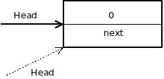
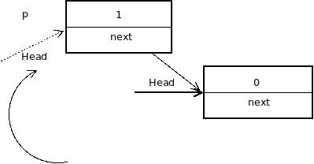

Date: 2013-01-14
Title: 再说下指针
Tags: 指针

**move from my old blog**

前几天看了那个Linus关于指针的回答，今天碰巧看数据结构看到了链表这块，突然对指针又有了点想法，在这里记录下。

以前写链表的插入操作，都是在main函数中写，没有用函数封装过，今天突然尝试用函数封装下插如的过程，最开始的代码是

    #include <stdlib.h>
    #include <stdio.h>
    
    struct node {
        int data;
        struct node *next;
    };

    void link_insert(struct node *head, int item) {
        struct node *p;
        
        p = (struct node*)malloc(sizeof(struct node));
        p -> data = item;
        p -> next = head;
        head = p;
    }

测试这个函数：

    int main()
    {
        struct node *head;
        head = NULL;
        head = (struct node*)malloc(sizeof(struct node));
        head -> data = 0;
        head -> next = NULL;
        link_insert(head, 1);
        link_insert(head, 2);

        struct node *p = head;
        while (p != NULL) {
        printf("%d\n", p->data);
        p = p->next;
        }
    }
结果只输出了一个0.经常gdb的调试，我才发现了我想当然的错。先说下我错的原因，用一个图表示我最开始的想法。

虚线的head表示c语言传值，将head的一个copy传入link_insert函数然后按照如下图所示的过程，进行了插入操作。我相当然的认为虚线的head就是一开始传入的head，其实函数调用前head指向哪，调用完后还指向哪。一画图一切都很明了，不画图，很容易想当然用上面的方式实现。

那怎么样才能让原head指针在函数中跟着动呢？即一只保持head指针指向头节点。我想到了双重指针。实现如下：

    void link_insert(struct node **head, int item) {
        struct node *p;
        p = (struct node *)malloc(sizeof(struct node))
        p -> data = item;
        p -> next = *head;
        *head = p;
    }

可以仿照我上面自己画下图理解，其实很好理解，我把指向头节点指针的指针的copy传入link_insert, 这样头节点的指针就不会丢失，能在函数外部一直保留。

编程时遇到指针时，应该多画图表示，这样才不容易想当然，陷入C语言指针的陷阱。